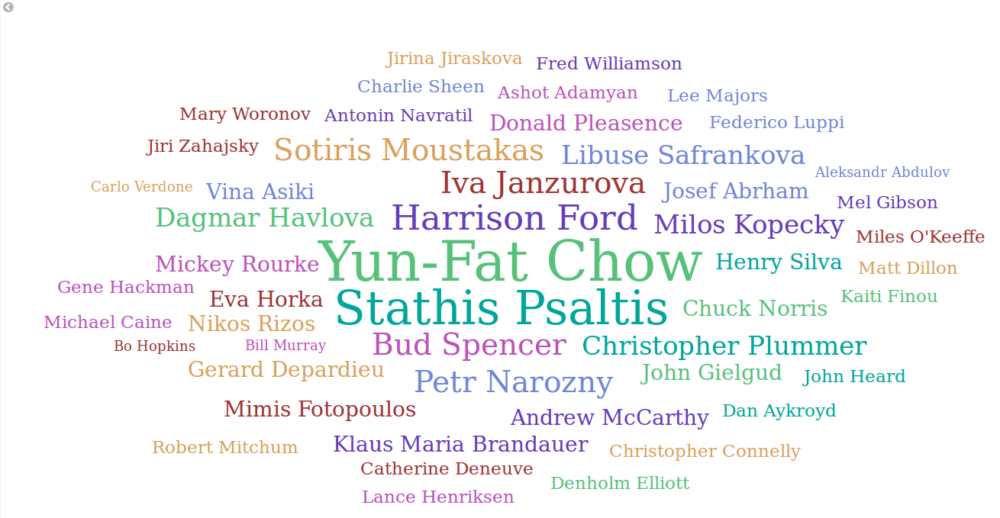
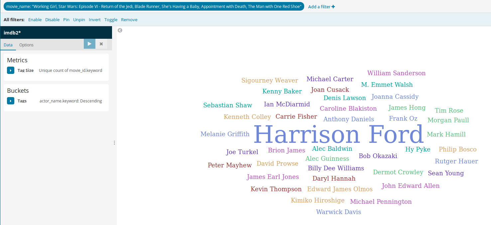
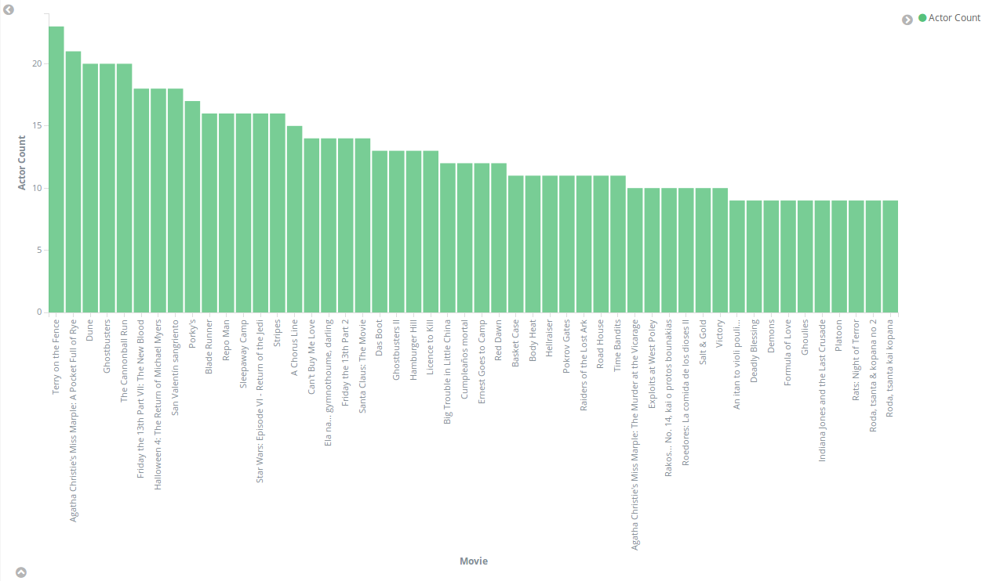
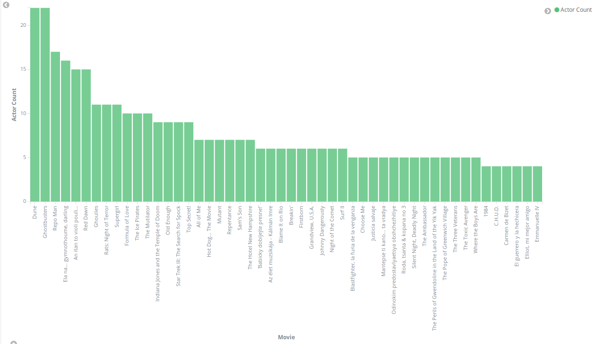
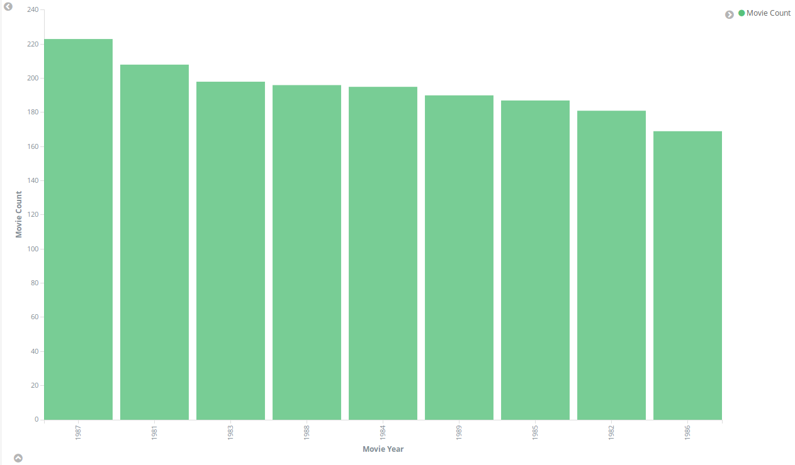
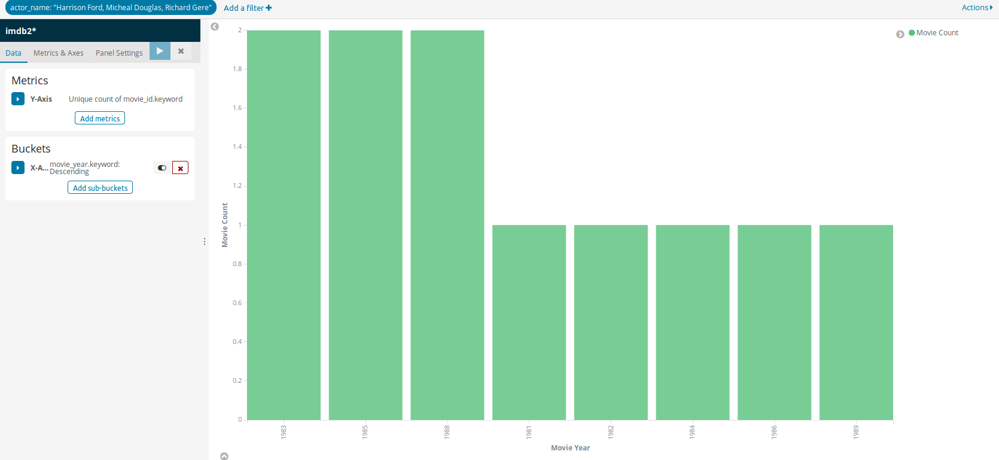
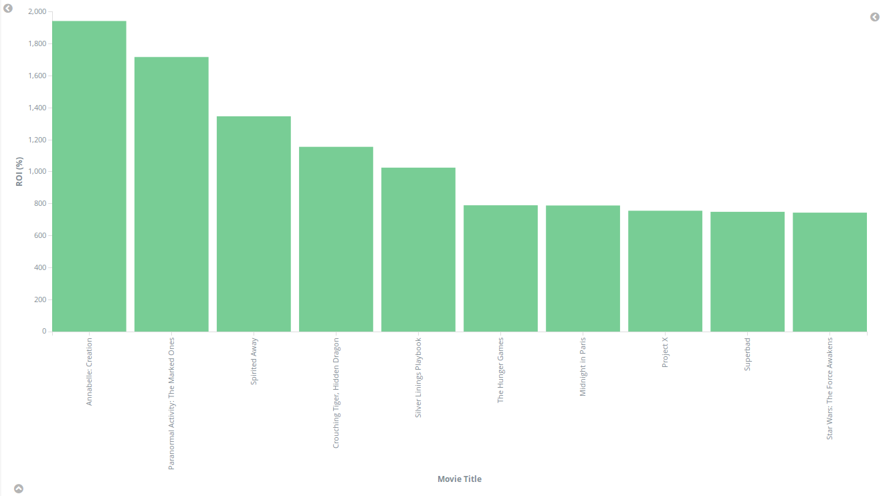

# Lab session # 7: Using the Elastic Stack to study scraped data from a web page
### Task 7.3: Study the obtained data using the Elastic Stack

#### Q73: Take a screenshot of the Kibana Dashboard showing the above plots without filters. Set a couple of filters, take screetshots. Add all the screenshots to the Lab7 folder of your answers repository.
#### Q74: Explain what you have done in the README.md file of the Lab7 folder of your answers repository, add the new plot. Push the code changes to your scrapy-lab repository

1. A tag cloud showing who are the most popular actors for the period. A new record is inserted every time that an actor participates in a movie, therefore, you can count how many records exist for each actor.

* Specific movies like "Working Girl", "Star Wars: Episode VI - Return of the Jedi", "Blade Runner", "She's Having a Baby", "Appointment with Death" are added as filter. Intentionally HArrison Ford's movies are selected.

2. A bar diagram showing how many actors employ each movie. Take the 50 movies with more actors for the period.

* Only movies in 1984 are selected.

3. A bard diagram showing the filming activity for each year (plot the total count of records per year).

* Only movies who has Harrison Ford, Richard Gere, Micheal Douglas is selected

4. Finally for the custom question we chose to scrape IMDb to identify the most successful movies in the 21st century in terms of financial terms. In other words, we plot the Return of Investment (ROI) for each movie based on the budget spent in its production and its world cumulative gross. For this purpose we wrote a new parsing function `parse_movie` which parses the movie's IMDB page before scraping the actors' pages from the movie credits' page. Note that:

#### Q75: How long have you been working on this session? What have been the main difficulties you have faced and how have you solved them?

We have worked approximately 10 hours each for this session, mainly in order to get acquinted with scrapy. Scraping IMDb and debugging scrapy e.g. realise that the domain name should not be included in the redirection links, took most of our time. Getting started with elastic and kibana was pretty easy with the provided package. Moreover, for the final part, we realised that there is a lack of information in IMDb regarding the finanes of many movies and it is hard with scrapy to gain control over which movie pages you scrape. It is possible that it gets stuck in a 'cluster' of movies with no financial information available.
